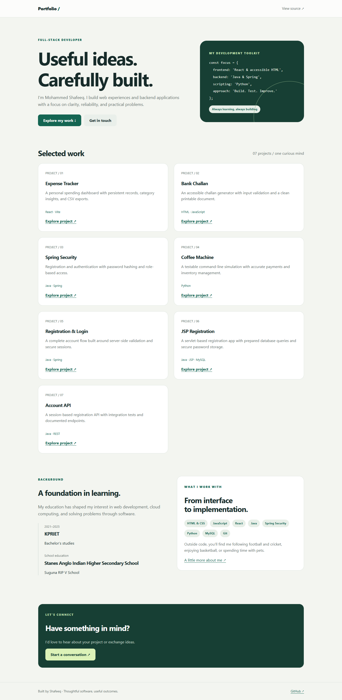

# Portfolio

A responsive, accessible developer portfolio that showcases the real projects in this GitHub account. No framework or build step is required.

## Run locally

```bash
python -m http.server 8000
```

Open http://localhost:8000.

## Content

Edit `index.html` for projects and background, `details.html` for contact links, and `styles.css` for styling. Education dates are retained from the original portfolio; update them when you confirm your current status. No career claims or credentials have been invented. The email link uses your existing published address.

## Accessibility

Semantic landmarks, a skip link, visible keyboard focus, responsive grids, and reduced-motion support. All dependencies are local.

## Development

Changes are checked by GitHub Actions. Keep credentials in environment variables and never commit `.env`, local databases, or build output.

## Preview



Local screenshot; transaction and registration fields use sample data.
